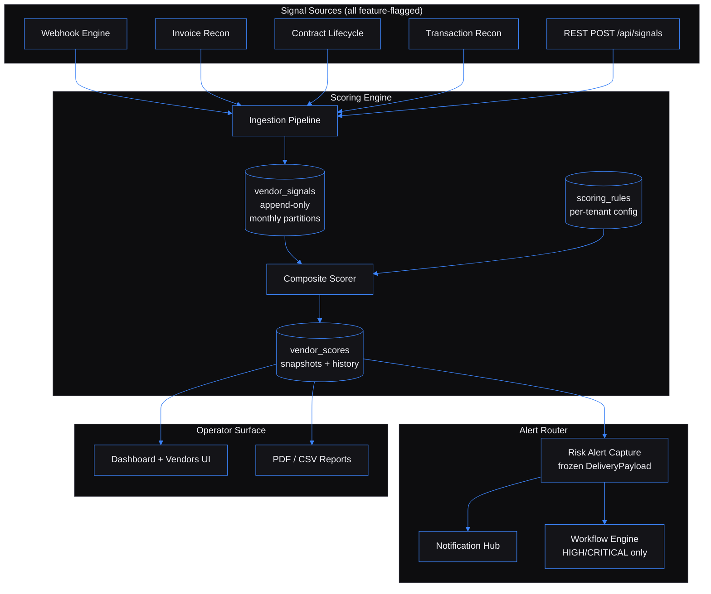

# Vendor Performance Intelligence Engine — Composite Risk Scoring for Procurement

Built by [Kingsley Onoh](https://kingsleyonoh.com) · Systems Architect

## The Problem

Of three hundred active vendors at a mid-market manufacturer, twenty are degrading right now and procurement can't tell which ones. The signals exist, but they live siloed: invoice reconciliation flags late payments in one system, contract lifecycle tracks SLA breaches in another, the webhook engine quietly drops integration events in a third. A vendor that ships late invoices, silently drops webhook events, and breaches contract obligations appears as three separate one-star problems instead of one five-star vendor-to-re-tender. The CFO finds out at the quarterly review, six months too late.

This engine correlates those signals across rolling 30/90/180-day windows, computes a weighted composite score per vendor per tenant, and fires band-crossing alerts to the Notification Hub before the next vendor incident lands on the CPO's desk. Built for procurement teams managing €5M+ annual vendor spend across 100+ active vendors. Even a 1% improvement in vendor performance against that spend pays for the engine many times over.

## Architecture



## Key Decisions

- I chose **server-rendered Rails 8 + Hotwire** over a React SPA because the operator UI is mostly tables, filters, and forms. Hotwire delivers ~95% of SPA feel for ~10% of the complexity, and the same ERB pipeline that renders the UI also renders the legally-defensible PDF reports — one view layer, one source of truth.
- I chose **append-only `vendor_signals` partitioned by month** over UPDATE-in-place because procurement decisions get audited. A Postgres trigger blocks DELETE at the database layer; corrections insert a new row and mark the previous `superseded`. Six months later the audit committee can replay every score back to its source signals.
- I chose **frozen `DeliveryPayload` snapshots on `risk_alerts`** over re-querying tenant identity at dispatch time. If the tenant renames itself between alert creation and a successful retry six hours later, the Notification Hub still receives the original `legal_name` — the snapshot is immutable. Same pattern on `vendor_reports.render_context` for byte-identical PDF re-renders thirty days later.
- I chose **standalone-first feature flags on every ecosystem integration** (`{SERVICE}_ENABLED=false` by default) over assumed dependencies. Someone cloning the repo runs `docker compose up` and gets a fully functional engine — the Hub, Workflow, Webhook, Invoice Recon, Contract Lifecycle, Recon, and RAG adapters each plug in independently or stay disabled.
- I chose **`Current.tenant` thread-local + Rack middleware** over baking `tenant_id` into every model query. The middleware resolves `X-API-Key` once, sets `Current.tenant`, and every controller/policy/serializer scopes through that. Cross-tenant 404 (never 403) is enforced by integration tests across every `/api/*` route.

## Setup

### Prerequisites

- Docker + Docker Compose (the project ships its own Ruby 3.3 dev container — no host Ruby needed)
- ~3 GB free disk space for the dev image + Postgres + Redis
- Ports 3000, 5434, 6384 free on the host (`postgres` and `redis` are remapped off the defaults to avoid collisions with sibling projects)

### Installation

```bash
git clone https://github.com/kingsleyonoh/vendor-performance-intelligence-engine.git
cd vendor-performance-intelligence-engine
cp .env.example .env

docker compose up -d postgres redis
bin/dc bundle install
bin/dc bin/rails db:migrate
bin/dc bin/rails vpi:setup
```

`bin/dc` is the project's wrapper around `docker compose run --rm dev` — every command runs inside the dev container.

`vpi:setup` is idempotent. It seeds the system catalog of signal definitions, creates the default tenant with §4.T identity columns populated, attaches the default scoring rule, and prints the raw API key once to stdout. Re-running it five times produces the same state.

### Try it locally with seed data

A demo seeder ships with the engine — useful for "show me what this does" before wiring any ecosystem source:

```bash
bin/dc bin/rails vpi:demo
```

That creates a UI login (`demo@example.com` / `demopass123`), eight vendors across categories, and 160 signals that drive a realistic spread of LOW / MEDIUM / HIGH bands. Then:

```bash
bin/dc bin/rails server -p 3000 -b 0.0.0.0
```

Open `http://localhost:3000`, log in, and you're on the dashboard with live KPIs against the seeded portfolio.

### Environment

```bash
cp .env.example .env
# edit .env — at minimum set RAILS_MASTER_KEY, SECRET_KEY_BASE, POSTGRES_PASSWORD
```

Every variable is documented inline in `.env.example` (76 vars total). The most relevant for a fresh install:

| Variable | Purpose |
|----------|---------|
| `RAILS_MASTER_KEY` | 32-hex-char Rails credentials key |
| `SECRET_KEY_BASE` | Cookie session secret — generate via `bin/dc bin/rails secret` |
| `DATABASE_URL` | Postgres connection — defaults to compose service `postgres:5432` |
| `REDIS_URL` | Redis URL — defaults to `redis://redis:6379/0` |
| `SELF_REGISTRATION_ENABLED` | `true` for self-hosted, `false` for managed deployments |
| `HUB_INGRESS_SECRET` | HMAC secret for inbound `POST /api/signals/from-hub` |
| `NOTIFICATION_HUB_ENABLED` | `false` by default — flip to wire outbound alerts |
| `WORKFLOW_ENGINE_ENABLED` | `false` by default — escalates HIGH/CRITICAL bands |
| `WEBHOOK_ENGINE_ENABLED` / `INVOICE_RECON_ENABLED` / `CONTRACT_ENGINE_ENABLED` / `RECON_ENGINE_ENABLED` / `RAG_PLATFORM_ENABLED` | Per-adapter feature flags, all default `false` |
| `SENTRY_DSN`, `AXIOM_TOKEN`, `POSTHOG_API_KEY`, `PROMETHEUS_ENABLED` | Observability — every wiring is no-op when env unset |

### Run

```bash
bin/dc bin/dev
```

Boots Puma + Sidekiq + the Tailwind watcher inside the `dev` container. UI at `http://localhost:3000`, API under `/api/*`. Sign in via Rails 8 built-in auth (email + password, seeded by `vpi:setup` or `vpi:demo`).

## How It Works

```
   Signal arrives
        │
        ▼
  ┌─────────────────────────────────────────┐
  │  Ingestion Pipeline                     │
  │  (validate → dedup → resolve vendor →   │
  │   range-check → INSERT vendor_signals)  │
  └─────────────────────────────────────────┘
        │
        ▼  ScoreRecomputeJob (Sidekiq)
  ┌─────────────────────────────────────────┐
  │  Composite Scorer                       │
  │  - load active scoring_rule for tenant  │
  │  - query in-window signals              │
  │  - scale each to 0..100 (signal_scalers)│
  │  - apply time decay (0.5^(age/halflife))│
  │  - aggregate per category               │
  │  - apply category_weights → score 0..100│
  │  - classify band (low/medium/high/crit) │
  │  - select top-5 contributors            │
  └─────────────────────────────────────────┘
        │
        ▼
  INSERT vendor_scores  (composite_score, band, trend, top_contributors)
        │
        ▼  if band changed
  ┌─────────────────────────────────────────┐
  │  Risk Alert Router                      │
  │  - dedup window check                   │
  │  - INSERT risk_alerts (status=pending)  │
  │  - Alerts::CapturePayload — FREEZE      │
  │    DeliveryPayload (TenantSnapshot,     │
  │    vendor, score, contributors)         │
  │  - HubDispatchJob → Notification Hub    │
  │  - if HIGH/CRITICAL → WorkflowEscalation│
  └─────────────────────────────────────────┘
```

The CPO sees the result in the dashboard ("twelve vendors crossed into HIGH this week, here's why each one"), gets the email/Telegram alert via the Hub, and pulls a vendor scorecard PDF that re-renders byte-identically thirty days later for the audit committee.

## Usage

The fastest integration path: tenant onboarding, signal ingest, score read.

```bash
# 1. Self-register a tenant (returns the raw API key once)
curl -X POST http://localhost:3000/api/tenants/register \
  -H 'Content-Type: application/json' \
  -d '{
    "tenant": {
      "name": "Acme Manufacturing",
      "slug": "acme-mfg",
      "legal_name": "Acme Manufacturing GmbH",
      "display_name": "Acme",
      "address": {"country_code": "DE", "city": "Berlin", "line1": "Hauptstraße 10"},
      "registration": {"tax_id": "DE123456789"},
      "contact": {"email": "procurement@acme-mfg.example"},
      "locale": "de-DE",
      "timezone": "Europe/Berlin"
    }
  }'

# 2. POST a vendor signal (the engine resolves the vendor, validates the signal,
#    inserts vendor_signals, and enqueues ScoreRecomputeJob)
curl -X POST http://localhost:3000/api/signals \
  -H 'X-API-Key: vpi_live_xxx...' \
  -H 'Content-Type: application/json' \
  -d '{
    "signal": {
      "source_system": "invoice_recon",
      "source_event_id": "vendor-globex-1234",
      "signal_code": "invoice.late_ratio_30d",
      "value_numeric": 0.42,
      "vendor_ref": {"normalized_name": "globex industrial ltd"},
      "window_start": "2026-01-01T00:00:00Z",
      "window_end": "2026-04-01T00:00:00Z",
      "recorded_at": "2026-04-25T12:00:00Z",
      "context": {"invoice_count": 38}
    }
  }'

# 3. Read the current composite score with top contributors
curl http://localhost:3000/api/vendors/<vendor_id>/score/current \
  -H 'X-API-Key: vpi_live_xxx...'
```

### What the engine handles for you

| Concern | How |
|---------|-----|
| Vendor name reconciliation | `Ingestion::VendorResolver` ladder — exact tax_id (1.00), exact normalized name (0.85), Levenshtein ≤ 2 (0.70), then new vendor. Pending matches surface in the operator alias-review queue. |
| Signal deduplication | Composite UNIQUE on `(tenant_id, source_system, source_event_id)` — the same Hub event reposted twice silently dedupes. |
| Time-weighted decay | `weight = 0.5^(age_days / half_life_days)` baked into the scorer. Default 45-day half-life, tunable per tenant. |
| Band-crossing alerts | Frozen `DeliveryPayload` snapshot at alert creation time. The dispatcher never re-queries — retries days later emit the original tenant identity. |
| Failed alert retry | `FailedAlertRetryJob` runs every 30 minutes with exponential backoff up to `MAX_ALERT_DISPATCH_ATTEMPTS`. Self-healing once the dependency returns. |
| Append-only audit trail | `vendor_signals` is INSERT-only — corrections insert a new row and mark the previous `superseded`. A Postgres trigger blocks DELETE at the database layer. |
| Multi-tenant isolation | Every `/api/*` route resolves `Current.tenant` via `X-API-Key` middleware. A curl with tenant A's key returns 404 for tenant B's resources in every controller (covered by integration tests). |
| Snapshot freezing | Alert and report templates render against frozen tenant snapshots stored on the row — re-rendering a PDF thirty days later produces byte-identical legal sections. |

### Endpoint reference

| Surface | Endpoints |
|---------|-----------|
| Tenants | `POST /api/tenants/register`, `GET /api/tenants/me`, `POST /api/tenants/me/rotate-key` |
| Signals | `POST /api/signals`, `POST /api/signals/from-hub` (HMAC), `GET /api/vendors/:id/signals` |
| Vendors | `GET /api/vendors`, `GET /api/vendors/:id`, `GET/POST/DELETE /api/vendors/:id/aliases`, `POST /api/vendors/:id/merge` |
| Scores | `GET /api/vendors/:id/score/current`, `GET /api/vendors/:id/score/history` |
| Alerts | `GET /api/alerts`, `POST /api/alerts/:id/acknowledge`, `POST /api/alerts/:id/suppress`, `POST /api/alerts/:id/retry` |
| Scoring rules | `GET/POST /api/scoring_rules`, `POST /api/scoring_rules/:id/activate`, `POST /api/scoring_rules/preview` |
| Reports | `POST /api/reports`, `GET /api/reports/:id`, `GET /api/reports/:id/download` (vendor_scorecard PDF, portfolio_risk CSV/PDF, retender_candidates CSV, trend_analysis CSV/PDF) |
| Ingestion | `GET/POST/PATCH /api/ingestion/sources`, `POST /api/ingestion/sources/:id/pull_now`, `GET /api/ingestion/runs` |
| Audit | `GET /api/audit-log` (admin-only), `GET /api/audit-log/:id` |
| Health | `GET /api/health`, `/api/health/db`, `/api/health/redis`, `/api/health/ready` |
| Metrics | `GET /metrics` — Prometheus exposition (HTTP Basic Auth via `METRICS_BASIC_AUTH_USER/PASS`) |

Full OpenAPI 3.1 spec at [`openapi.yaml`](openapi.yaml).

## Tests

```bash
bin/dc bin/rails test                      # unit + integration (Minitest)   — 947 runs
bin/dc bin/rails test:system               # Capybara + Playwright UI        —  70 runs
bin/dc bin/rake test:e2e                   # shell-level HTTP against Puma   —  27 runs
bin/dc bundle exec rubocop                 # lint
bin/dc bundle exec brakeman                # security scan
bin/dc bin/rake perf:bench:roundtrip       # POST signal → GET score < 500ms p95
bin/dc bin/rake perf:bench:band_crossing   # band crossing → Hub delivery < 2s p95
bin/dc bin/rake perf:bench:reports         # 3 report types < 30s for 120 vendors
bin/dc bin/rake perf:load                  # signal ingestion load test (short mode)
```

## AI Integration

This project includes machine-readable context for AI tools:

| File | What it does |
|------|-------------|
| [`llms.txt`](llms.txt) | Project summary for LLMs ([llmstxt.org](https://llmstxt.org)) |
| [`AGENTS.md`](AGENTS.md) | Full codebase instructions for AI coding agents |
| [`openapi.yaml`](openapi.yaml) | OpenAPI 3.1 API specification |
| [`mcp.json`](mcp.json) | MCP server definition for AI IDEs |

### Cursor / Other AI IDEs
Point your AI agent at `AGENTS.md` for full codebase context.

## Deployment

The production stack runs behind Traefik with TLS via Let's Encrypt. The deploy target is `vendors.kingsleyonoh.com`; CI/CD ships images to GHCR via GitHub Actions on push to `main`.

### Production Stack

| Component | Role |
|-----------|------|
| `web` | Rails 8 + Puma — API + Hotwire UI |
| `worker` | Sidekiq 7 — background jobs (scoring, alerts, ingestion, reports, partitions) |
| `migrate` | One-shot migration runner — `db:migrate` then `vpi:setup` |
| `postgres` | PostgreSQL 16 with native range partitioning on `vendor_signals` |
| `redis` | Redis 7 — Sidekiq queues, rate-limit counters, tenant cache |
| `postgres-backup` | Daily encrypted `pg_dump` → Backblaze B2 (30-day retention) |

Traefik runs as a host-level service (not inside the application stack), terminating TLS via Let's Encrypt and routing `Host(\`vendors.kingsleyonoh.com\`)` to the `web` service.

### Self-Host

```bash
# Pull the production image
docker pull ghcr.io/kingsleyonoh/vendor-performance-intelligence-engine:latest

# Or use the compose file (set VPI_IMAGE in .env on the server)
docker compose -f docker-compose.prod.yml up -d
```

Set the environment variables listed in **Setup → Environment** before starting. `${POSTGRES_PASSWORD:?}` and other required secrets fail-closed if absent.

---

Full case study, architectural breakdown, and engineering deep-dive at [kingsleyonoh.com/projects/vendor-performance-intelligence-engine](https://www.kingsleyonoh.com/projects/vendor-performance-intelligence-engine)
