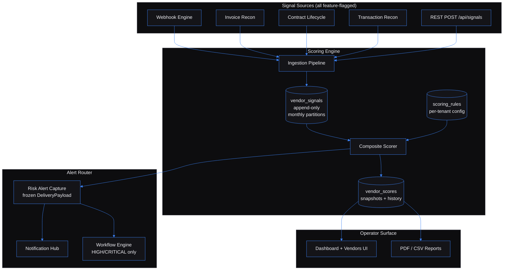

# Vendor Performance Intelligence Engine — Composite Risk Scoring for Procurement

Built by [Kingsley Onoh](https://kingsleyonoh.com) · Systems Architect

## The Problem

Of three hundred active vendors at a mid-market manufacturer, twenty are degrading right now and procurement can't tell which ones. The signals exist, but they live siloed: invoice reconciliation flags late payments in one system, contract lifecycle tracks SLA breaches in another, the webhook engine quietly drops integration events in a third. A vendor that ships late invoices, silently drops webhook events, and breaches contract obligations appears as three separate one-star problems instead of one five-star vendor-to-re-tender. The CFO finds out at the quarterly review, six months too late.

This engine correlates those signals across rolling 30/90/180-day windows, computes a weighted composite score per vendor per tenant, and fires band-crossing alerts to the Notification Hub before the next vendor incident lands on the CPO's desk. Built for procurement teams managing €5M+ annual vendor spend across 100+ active vendors.

## Architecture



## Key Decisions

- I chose **Ruby on Rails 8** over Go or Python because procurement-UI delivery time matters more than raw throughput. Hotwire + ViewComponent + ActionPolicy together remove three weeks of UI infrastructure work, and Rails 8's Solid Queue / built-in authentication generator drop two more dependencies the team would otherwise own.
- I chose **rules-driven scoring with per-tenant config** over a gradient-boosted classifier because procurement officers don't buy black boxes they have to defend to a CFO. Every score decomposes into category contributions and the top five underlying signals. Interpretability is the product feature; ML is a Phase 4 supplement, not a replacement.
- I chose **append-only `vendor_signals` with monthly Postgres partitions** over a mutable signal table because deterministic recompute matters more than write convenience. Given the same signals and weights, two scorer runs produce identical scores. Corrections insert a new row and mark the previous one `superseded`. The audit trail is trivial because the data structure is honest.
- I chose **frozen `DeliveryPayload` and `RenderContext` snapshots** at alert/report generation time over live tenant lookups because re-rendering a PDF thirty days later must produce byte-identical legal sections, even if the tenant renamed itself in between. Dispatcher code reads from `risk_alerts.delivery_payload` only — never re-queries `tenants`. Strict-undefined ERB rendering catches missing tokens at CI time, not in production.
- I chose **standalone-first with feature-flagged ecosystem adapters** (`{SERVICE}_ENABLED=false` by default) over baking ecosystem connections into the core because someone who clones this repo and runs `docker compose up` should get a fully functional product. Hub, Workflow, Webhook, Invoice, Contract, Transaction, RAG — each adapter independently enables. The core scorer never depends on any of them.

## Setup

### Prerequisites

- Docker 24+ and Docker Compose v2 (no host Ruby toolchain required — every command runs inside the `dev` service)
- 4 GB free RAM for the dev stack (Postgres + Redis + Rails + Sidekiq)
- Optional: NATS server if you plan to subscribe to Contract Lifecycle JetStream events

### Installation

```bash
git clone https://github.com/kingsleyonoh/vendor-performance-intelligence-engine.git
cd vendor-performance-intelligence-engine
docker compose up -d postgres redis
bin/dc bundle install
bin/dc bin/rails db:create db:migrate
bin/dc bin/rails vpi:setup
```

The `vpi:setup` task is idempotent. It seeds the system catalog of signal definitions, creates the default tenant with §4.T identity columns populated, attaches the default scoring rule, and prints the raw API key once to stdout. Re-running it five times produces the same state.

### Environment

```bash
cp .env.example .env
# edit .env — at minimum set RAILS_MASTER_KEY, SECRET_KEY_BASE, POSTGRES_PASSWORD
```

Every variable is documented inline in `.env.example`. The most relevant for a fresh install:

| Variable | Purpose |
|----------|---------|
| `RAILS_MASTER_KEY` | 32-hex-char Rails credentials key |
| `SECRET_KEY_BASE` | Cookie session secret — `bin/dc bin/rails secret` |
| `DATABASE_URL` | Postgres connection — defaults to compose service `postgres:5432` |
| `REDIS_URL` | Redis URL — defaults to `redis://redis:6379/0` |
| `SELF_REGISTRATION_ENABLED` | `true` for self-hosted, `false` for managed deployments |
| `HUB_INGRESS_SECRET` | HMAC secret for inbound `POST /api/signals/from-hub` |
| `NOTIFICATION_HUB_ENABLED` | `false` by default — flip to wire outbound alerts |
| `WORKFLOW_ENGINE_ENABLED` | `false` by default — escalates HIGH/CRITICAL bands |
| `WEBHOOK_ENGINE_ENABLED` / `INVOICE_RECON_ENABLED` / `CONTRACT_ENGINE_ENABLED` / `RECON_ENGINE_ENABLED` / `RAG_PLATFORM_ENABLED` | Per-adapter feature flags, all default `false` |

### Run

```bash
bin/dc bin/dev
```

That boots Puma + Sidekiq + the Tailwind watcher inside the `dev` container. The UI lives at `http://localhost:3000`, the API under `/api/*`. Sign in via the Rails 8 built-in auth (email + password, seeded by `vpi:setup`).

## How It Works

```
   Signal arrives
        │
        ▼
  ┌─────────────────────────────────────────┐
  │  Ingestion Pipeline                     │
  │  (validate → dedup → resolve vendor →   │
  │   range-check → INSERT vendor_signals)  │
  └─────────────────────────────────────────┘
        │
        ▼  ScoreRecomputeJob (Sidekiq)
  ┌─────────────────────────────────────────┐
  │  Composite Scorer                       │
  │  - load active scoring_rule for tenant  │
  │  - query in-window signals              │
  │  - scale each to 0..100 (signal_scalers)│
  │  - apply time decay (0.5^(age/halflife))│
  │  - aggregate per category               │
  │  - apply category_weights → score 0..100│
  │  - classify band (low/medium/high/crit) │
  │  - select top-5 contributors            │
  └─────────────────────────────────────────┘
        │
        ▼
  INSERT vendor_scores  (composite_score, band, trend, top_contributors)
        │
        ▼  if band changed
  ┌─────────────────────────────────────────┐
  │  Risk Alert Router                      │
  │  - dedup window check                   │
  │  - INSERT risk_alerts (status=pending)  │
  │  - Alerts::CapturePayload — FREEZE      │
  │    DeliveryPayload (TenantSnapshot,     │
  │    vendor, score, contributors)         │
  │  - HubDispatchJob → Notification Hub    │
  │  - if HIGH/CRITICAL → WorkflowEscalation│
  └─────────────────────────────────────────┘
```

The CPO sees the result in the dashboard ("twelve vendors crossed into HIGH this week, here's why each one"), gets the email/Telegram alert via the Hub, and pulls a vendor scorecard PDF that re-renders byte-identically thirty days later for the audit committee.

## Usage

The fastest integration path: tenant onboarding, signal ingest, score read.

```bash
# 1. Self-register a tenant (returns the raw API key once)
curl -X POST http://localhost:3000/api/tenants/register \
  -H 'Content-Type: application/json' \
  -d '{
    "tenant": {
      "name": "Acme Manufacturing",
      "slug": "acme-mfg",
      "legal_name": "Acme Manufacturing GmbH",
      "display_name": "Acme",
      "address": {"country_code": "DE", "city": "Berlin", "line1": "Hauptstraße 10"},
      "registration": {"tax_id": "DE123456789"},
      "contact": {"email": "procurement@acme-mfg.example"},
      "locale": "de-DE",
      "timezone": "Europe/Berlin"
    }
  }'

# 2. POST a vendor signal (the engine resolves the vendor, validates the signal,
#    inserts vendor_signals, and enqueues ScoreRecomputeJob)
curl -X POST http://localhost:3000/api/signals \
  -H 'X-API-Key: vpi_live_xxx...' \
  -H 'Content-Type: application/json' \
  -d '{
    "signal": {
      "source_system": "invoice_recon",
      "source_ref": "vendor-globex-1234",
      "signal_code": "invoice.late_payment_rate",
      "value_numeric": 0.42,
      "window_start": "2026-01-01T00:00:00Z",
      "window_end": "2026-04-01T00:00:00Z",
      "recorded_at": "2026-04-25T12:00:00Z",
      "context": {"invoice_count": 38}
    }
  }'

# 3. Read the current composite score with top contributors
curl http://localhost:3000/api/vendors/<vendor_id>/score/current \
  -H 'X-API-Key: vpi_live_xxx...'
```

### What the engine handles for you

| Concern | How |
|---------|-----|
| Vendor name reconciliation | 5-rung `Ingestion::VendorResolver` ladder — exact tax_id, exact normalized name, Levenshtein ≤ 2, then new vendor. Pending matches surface in the operator alias-review queue. |
| Signal deduplication | Composite UNIQUE on `(tenant_id, source_system, source_event_id)` — the same Hub event reposted twice silently dedupes. |
| Time-weighted decay | `weight = 0.5^(age_days / half_life_days)` baked into the scorer. Default 45-day half-life, tunable per tenant. |
| Band-crossing alerts | Frozen `DeliveryPayload` snapshot at alert creation time. The dispatcher never re-queries — retries days later emit the original tenant identity. |
| Failed alert retry | `FailedAlertRetryJob` runs every 30 minutes with exponential backoff up to `MAX_ALERT_DISPATCH_ATTEMPTS`. Self-healing once the dependency returns. |
| Append-only audit trail | `vendor_signals` is INSERT-only — corrections insert a new row and mark the previous `superseded`. Postgres trigger enforces this at the database layer. |
| Multi-tenant isolation | Every `/api/*` route resolves `Current.tenant` via `X-API-Key` middleware. A curl with tenant A's key returns 404 for tenant B's resources in every controller (covered by integration tests). |
| Snapshot freezing | Alert and report templates render against frozen tenant snapshots stored on the row — re-rendering a PDF thirty days later produces byte-identical legal sections. |

### Endpoint reference

| Surface | Endpoints |
|---------|-----------|
| Tenants | `POST /api/tenants/register`, `GET /api/tenants/me`, `POST /api/tenants/me/rotate-key` |
| Signals | `POST /api/signals`, `POST /api/signals/from-hub` (HMAC), `GET /api/vendors/:id/signals` |
| Vendors | `GET/POST/PATCH /api/vendors`, `GET/POST/DELETE /api/vendors/:id/aliases`, `POST /api/vendors/:id/merge` |
| Scores | `GET /api/vendors/:id/score/current`, `GET /api/vendors/:id/score/history` |
| Alerts | `GET /api/alerts`, `POST /api/alerts/:id/acknowledge`, `POST /api/alerts/:id/suppress`, `POST /api/alerts/:id/retry` |
| Scoring rules | `GET/POST /api/scoring-rules`, `POST /api/scoring-rules/:id/activate`, `POST /api/scoring-rules/preview` |
| Reports | `POST /api/reports`, `GET /api/reports/:id`, `GET /api/reports/:id/download` (vendor_scorecard PDF, portfolio_risk CSV/PDF, retender_candidates CSV, trend_analysis CSV/PDF) |
| Ingestion sources | `GET/POST/PATCH /api/ingestion/sources`, `POST /api/ingestion/sources/:id/pull-now`, `GET /api/ingestion/runs` |
| Health | `/api/health`, `/api/health/db`, `/api/health/redis`, `/api/health/ready` |

Full OpenAPI 3.1 spec at [`openapi.yaml`](openapi.yaml).

## Tests

```bash
bin/dc bin/rails test                  # unit + integration (Minitest)
bin/dc bin/rails test:system           # Capybara + Playwright UI
bin/dc bin/rake test:e2e               # shell-level HTTP against booted Puma
bin/dc bundle exec rubocop             # lint
bin/dc bundle exec brakeman             # security scan
bin/dc bin/rake perf:bench:roundtrip   # POST signal → GET score < 500ms p95
bin/dc bin/rake perf:bench:band_crossing # band crossing → Hub delivery < 2s p95
bin/dc bin/rake perf:bench:reports     # 3 report types < 30s for 120 vendors
```

## AI Integration

This project includes machine-readable context for AI tools:

| File | What it does |
|------|-------------|
| [`llms.txt`](llms.txt) | Project summary for LLMs ([llmstxt.org](https://llmstxt.org)) |
| [`AGENTS.md`](AGENTS.md) | Full codebase instructions for AI coding agents |
| [`openapi.yaml`](openapi.yaml) | OpenAPI 3.1 API specification |
| [`mcp.json`](mcp.json) | MCP server definition for AI IDEs |

### Cursor / Other AI IDEs
Point your AI agent at `AGENTS.md` for full codebase context.

## Deployment

This project runs on a Hetzner VPS behind Traefik with automatic image pulls via GitHub Actions. The production target is `vendors.kingsleyonoh.com`.

### Production Stack

| Component | Role |
|-----------|------|
| `web` | Rails 8 + Puma — API + Hotwire UI |
| `worker` | Sidekiq 7 — background jobs (scoring, alerts, ingestion, reports, partitions) |
| `migrate` | One-shot migration runner — `db:migrate` then `vpi:setup` |
| `postgres` | PostgreSQL 16 with native range partitioning on `vendor_signals` |
| `redis` | Redis 7 — Sidekiq queues, rate-limit counters, tenant cache |
| `postgres-backup` | Daily `pg_dump` → optional GPG encryption → optional Backblaze B2 upload |

Traefik runs as a host-level service (not inside the application stack), terminating TLS via Let's Encrypt and routing `Host(\`vendors.kingsleyonoh.com\`)` to the `web` service.

### Self-Host

```bash
# Pull the production image
docker pull ghcr.io/kingsleyonoh/vendor-performance-intelligence-engine:latest

# Or use the compose file (set VPI_IMAGE in .env on the server)
docker compose -f docker-compose.prod.yml up -d
```

Set the environment variables listed in **Setup → Environment** before starting. `${POSTGRES_PASSWORD:?}` and other required secrets fail-closed if absent.

<!-- THEATRE_LINK -->
